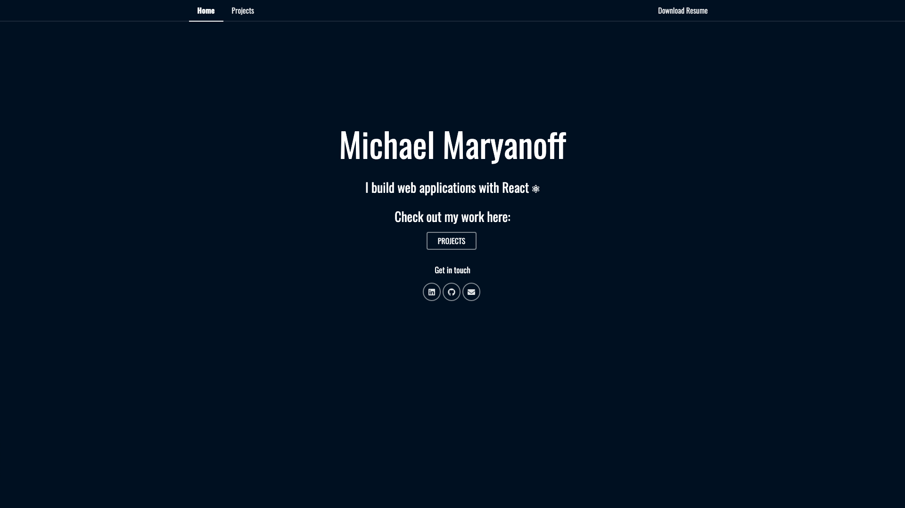

<h1 align="center">
    My personal site
</h1>
<h3 align="center">

⚛ Built with [React](https://github.com/facebook/react) ⚛

</h3>

In this repository you will find the code for my personal website, which I use to showcase my personal projects! It also serves as a small window into how I structure and write my code in React.

---

## Installation instructions

Make sure you have `npm` [installed](https://treehouse.github.io/installation-guides/mac/node-mac.html) on your machine.

Once repository is downloaded, `cd` to top level directory and run:

`npm install`

Once installed, run:

`yarn start` or `npm start`

That's it!
